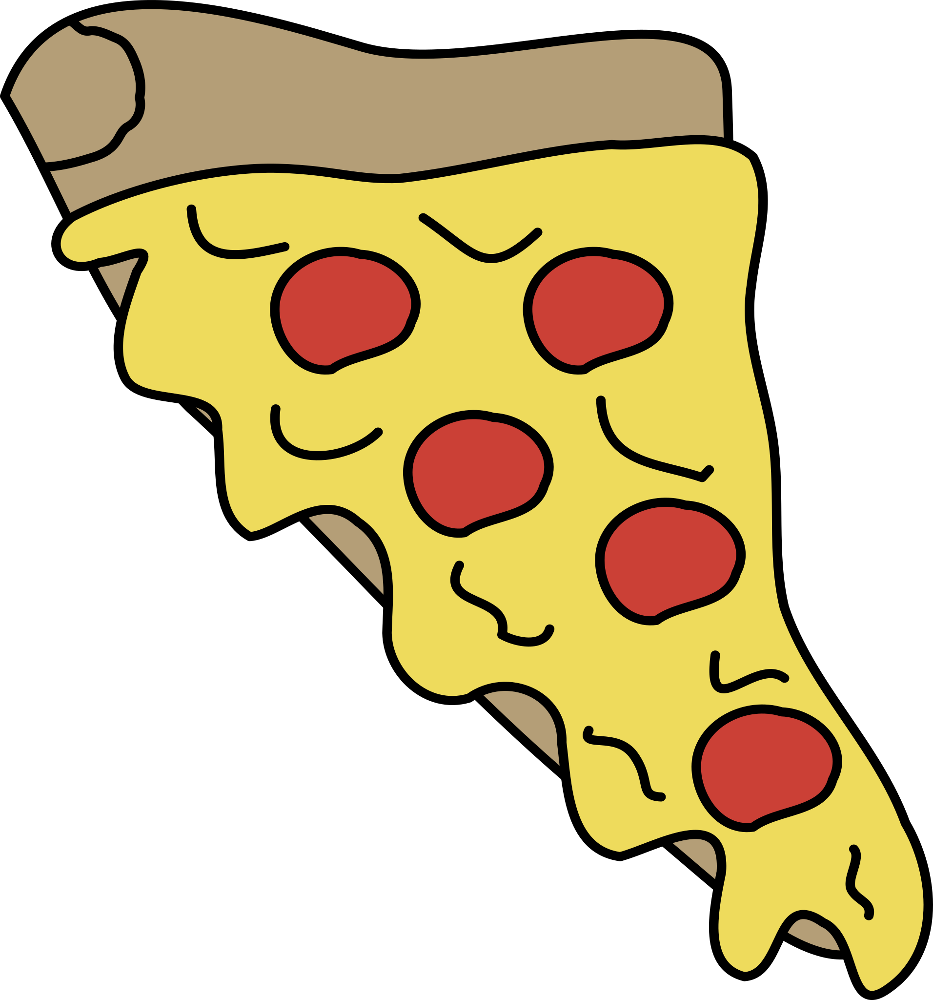

  

  <h3 align="center">PizPizza</h3>

  

    This site is a business card for selling online food stores with delivery during the pandemic COVID2020.
     
     
    <a href="https://khantorot.github.io/pizpizza">View Project</a>
    ·
    <a href="https://github.com/khantorot/pizpizza/issues">Report Bug</a>
    ·
    <a href="#top">Explore the docs</a>
  

## About The Project

* Great gratitude to Shamen (Wama) for card design. 
* Temporary content was taken from an unknown resource.

## License

This project is licensed under the MIT License - see the [LICENSE](https://github.com/khantorot/pizpizza/blob/main/LICENSE) file for details

## Contact

Email - khantorot@gmail.com

<a href="#top">back to top ↑</a>
